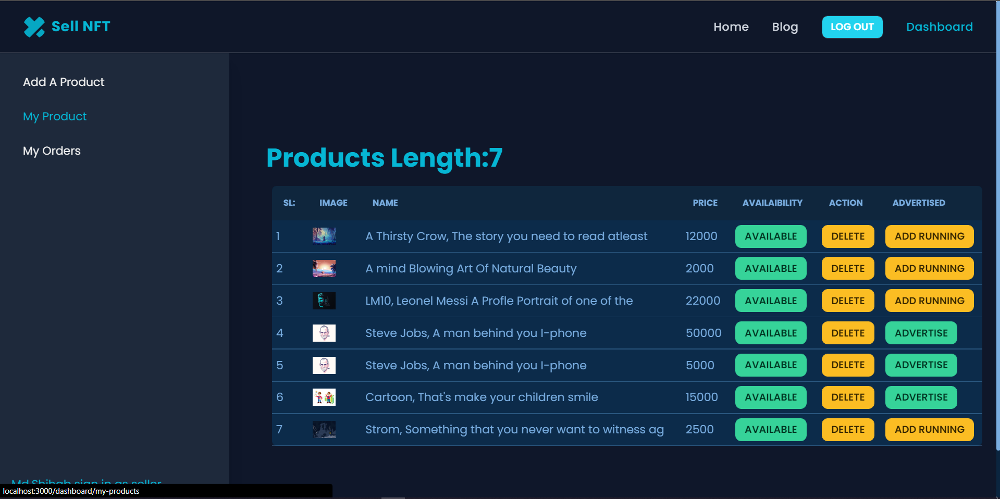

# [Sell NFT](https://sell-nft.web.app/)

an nft resalling marketplace model web platform

[Sell NFT](https://sell-nft.web.app/) is website where user can login with email password or google and buy and sell there product. also there is ferure called advertidsed, if an seller want he can advertised his/her products in website

# Live Website

https://sell-nft.web.app/

# key Feature

- Authentication
  - using filrebase
  - JWT
- Authorization
  - Admin route
  - Seller Route
  - buyer Route
  - Private Route
- Goole Login
- Add Products
- Advertised your Products
- Book Products
- Seller Dashboard
- Reporte Product
- Admin Dasbord
- If Admin Want
  - dlete an user from website
  - verify an seller from his/her dashbord
  - delete reported Products
- displayverifiyed mark if an user is verifyed

## Used NPM Packeges

- react router dom
- react quey (ten stack query)
- react hook form
- react icons
- prime icon
- date-fns
- axiox
- react toastify
- ## for styling
  - tailwind css
  - daysi ui
  - litter bit of raw CSS

# Hoisted

## backend : Vercel

## FronEnd : [Firebase](https://sell-nft.web.app)
